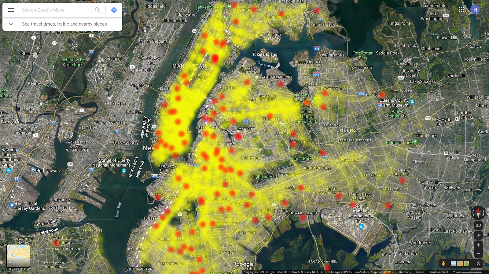

# nyc_crashes: Crash Data from NYC analyzed and visualized
Data from [here](https://data.cityofnewyork.us/Public-Safety/Motor-Vehicle-Collisions-Crashes/h9gi-nx95) will be analyzed both visually and numerically.

Map of killed or injured cyclists:

# start docker containers
`docker-compose up`
